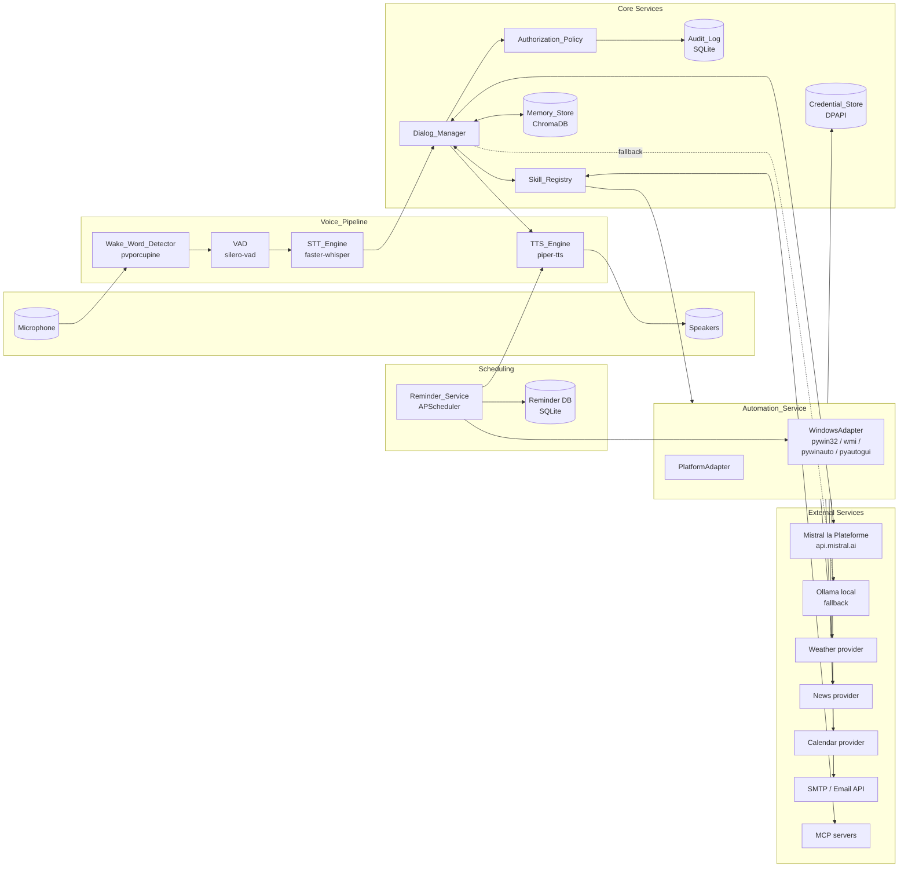
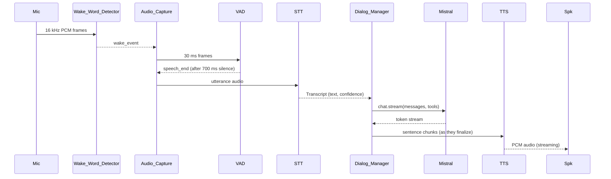
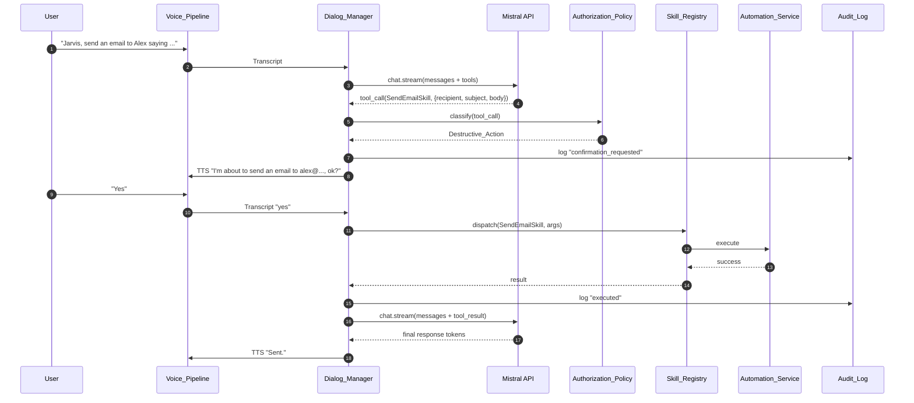
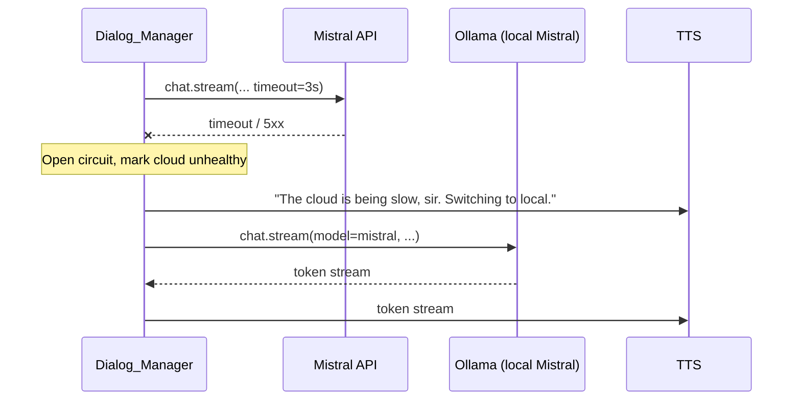

# Design Document

## Overview

JARVIS is implemented as an asynchronous Python 3.11+ application that wires together a real-time voice pipeline, a Mistral-AI-powered Dialog Manager, an extensible Skill plugin system, an encrypted long-term Memory Store, a persistent Reminder Service, and a Windows Automation Service. The system is structured around three concurrent loops cooperating over asyncio queues:

1. **Audio capture loop** — owns the microphone, feeds the Wake Word Detector and the STT Engine.
2. **Dialog loop** — owns Conversation_State, calls the Mistral API with streaming + function calling, dispatches Tool_Calls, and emits Assistant_Responses.
3. **Output loop** — receives token / sentence chunks from the Dialog loop and drives the TTS Engine + audio playback.

The design enforces the 800 ms Latency_Budget by streaming Mistral tokens directly into the TTS Engine at sentence boundaries, by running Wake Word Detection and VAD on lightweight local models, and by supporting Ollama-hosted Mistral as a low-latency local fallback.

A hard separation between platform-neutral logic (Dialog_Manager, Skill_Registry, Memory_Store, Reminder_Service core, Authorization_Policy) and platform-specific drivers (Windows DPAPI, WMI brightness, Win32 media keys, win10toast, pywinauto) is enforced by the `PlatformAdapter` abstraction so future macOS and Linux ports do not require touching the dialog or skill layers.

### Research Summary

The design choices are anchored in the following findings from the requirements review and the named technologies:

- **Mistral SDK (`mistralai` Python package)** — supports both `chat.complete` and `chat.stream`, native tool/function calling with JSON Schema parameter definitions, and exposes typed pydantic models for tool call deltas. This matches Requirement 19.4 (function calling), 19.5 (streaming), and 12.2 (sentence-boundary streaming). Source: https://docs.mistral.ai/capabilities/function_calling/ and https://docs.mistral.ai/api/.
- **Porcupine (`pvporcupine`)** — small footprint (<2 MB), <30 ms inference, supports custom keyword files. Industry-published FAR around 0.1 / hour and FRR <0.05 at 1–3 m on the public benchmark, satisfying Requirement 18.2 / 18.3.
- **`silero-vad`** — torch-free CPU-friendly VAD with a 30 ms hop, suited to the 700 ms trailing-silence threshold (Requirement 1.3).
- **`faster-whisper`** — CTranslate2-backed Whisper, ~5x faster than reference Whisper, supports streaming partial transcripts. Selected for local-only privacy mode (Requirement 13.2).
- **`piper-tts`** — neural TTS with British male voices ("en_GB-alan-medium") shipped as ONNX, runs ~real-time on CPU, supports streaming PCM output. Matches Requirement 11.2 default voice.
- **`chromadb`** with `sentence-transformers` (`all-MiniLM-L6-v2`) embeddings — local, embedded vector store with deterministic similarity ordering when persistence is keyed (relevant to CP3).
- **Windows DPAPI** — accessed via `pywin32` (`win32crypt.CryptProtectData` / `CryptUnprotectData`) for secret encryption (Requirement 13.1, CP11). The `keyring` library is used for the OS Credential Manager backing where a managed entry is preferable to raw blobs.
- **Windows brightness** via `wmi` (`WmiMonitorBrightnessMethods.WmiSetBrightness`) — the documented mechanism for Requirement 4.7. Some external monitors do not implement this WMI class, which justifies the "not_supported" branch in 4.8.
- **`APScheduler`** with a SQLAlchemy-backed `SQLAlchemyJobStore` over SQLite — provides persistent scheduling that survives application restart, satisfying Requirement 6.6.
- **MCP Python SDK (`mcp`)** — provides a stdio/SSE client we wrap in a `MCPSkillAdapter` so external MCP servers contribute additional Skills (Requirement 14.6).

## Architecture

### High-Level System Diagram



### Concurrency Model

The application runs a single asyncio event loop. Audio I/O uses `sounddevice` callbacks that push frames into bounded asyncio queues; CPU-bound model inference (Whisper, Piper) is offloaded to a `concurrent.futures.ThreadPoolExecutor` and awaited via `loop.run_in_executor`. The Mistral SDK is invoked through its `async` client so streaming token arrivals do not block other work.



### Wake-to-Response Flow with Tool Call and Confirmation



### Mistral → Local Fallback Flow



The fallback is governed by a small `BackendSelector` with a circuit breaker (3 s open timeout, 30 s cool-down) and applies a uniform request shape so Mistral and Ollama are interchangeable from the Dialog_Manager perspective.

## Components and Interfaces

All interfaces are sketched in Python type-stub form. They live in `src/jarvis/` with the layout described in the Project Structure section.

### Wake_Word_Detector

Responsibility: continuously consume microphone PCM and emit a `wake_event` when the configured phrase is heard. Backed by Porcupine.

```python
class WakeWordDetector:
    def __init__(self, access_key: str, keyword_paths: list[Path], sensitivity: float): ...
    async def run(self, frames_in: AudioStream, on_wake: Callable[[], Awaitable[None]]) -> None: ...
    async def aclose(self) -> None: ...
```

- Porcupine expects 16 kHz / 16-bit mono / 512-sample frames; an internal `AudioReframer` adapts the `sounddevice` callback chunk size.
- Sensitivity is configurable per keyword to tune FAR vs FRR (Requirement 18).
- Custom keyword `.ppn` files supplied by the user are validated for their platform tag at load time.

### STT_Engine

Responsibility: produce a `Transcript(text, confidence)` from a captured utterance.

```python
class STTEngine(Protocol):
    async def transcribe(self, audio: AudioBuffer, language: str) -> Transcript: ...

class FasterWhisperSTT(STTEngine): ...   # default, local
class CloudSTT(STTEngine): ...           # optional, e.g., OpenAI Whisper API
```

- VAD: `silero-vad` integrated as a separate `SileroVAD` that emits `speech_start` / `speech_end` events to the audio capture loop. The 700 ms trailing-silence threshold from Requirement 1.3 is enforced here, not in the STT.
- Streaming partial transcripts are exposed via `transcribe_stream` for future "live caption" features but are not on the wake-to-response path.
- A `confidence` is computed as `mean(exp(token_logprob))` from faster-whisper segments and gated at 0.4 (Requirement 1.8).

### Dialog_Manager

Responsibility: orchestrate Conversation_State, retrieve memories, call Mistral with tools, dispatch Tool_Calls (with confirmation), and stream output sentences to TTS.

```python
class DialogManager:
    def __init__(
        self,
        backend: LLMBackend,
        skills: SkillRegistry,
        memory: MemoryStore,
        policy: AuthorizationPolicy,
        persona: PersonaProfile,
        tts: TTSEngine,
        audit_log: AuditLog,
    ): ...

    async def handle_turn(self, transcript: Transcript, state: ConversationState) -> AssistantResponse: ...
```

Internal control loop (simplified):

```python
async def handle_turn(self, transcript, state):
    if transcript.text == "" or transcript.confidence < 0.4:
        return await self.ask_repeat()
    state.append_user(transcript.text)
    memories = await self.memory.retrieve(transcript.text, k=self.cfg.memory_k)
    messages = self._render_messages(state, memories)
    tools = self.skills.mistral_tool_definitions()

    while True:
        async with self.backend.stream(messages, tools=tools) as stream:
            sentence_buf = SentenceAccumulator()
            tool_calls: list[ToolCall] = []
            async for event in stream:
                if event.type == "content_delta":
                    for sentence in sentence_buf.feed(event.text):
                        await self.tts.speak(sentence)
                elif event.type == "tool_call":
                    tool_calls.append(event.tool_call)
            tail = sentence_buf.flush()
            if tail and not tool_calls:
                await self.tts.speak(tail)

        if not tool_calls:
            break

        for tc in tool_calls:
            result = await self._dispatch_with_authorization(tc, state)
            messages.append(self._tool_result_message(tc, result))
        # loop back so the model can integrate tool results

    state.append_assistant(messages[-1].content)
    await self.memory.persist_turn(state.last_turn(), persona=self.persona)
    return AssistantResponse.from_state(state)
```

- **Persona enforcement (Requirement 11, CP14):** the first message in `_render_messages` is *always* the persona system prompt (`PersonaProfile.system_prompt`). A post-generation guard scans the final text for forbidden self-references ("ChatGPT", "Claude", "as an AI language model") and either rewrites them ("As JARVIS, ...") or triggers a single regeneration with a stricter directive.
- **Acknowledgement utterance (Requirement 12.3):** when the tool dispatch loop's wall time exceeds 1.5 s, an `asyncio.TimerHandle` schedules a `tts.speak("One moment, sir.")`.
- **Backend abstraction:**

  ```python
  class LLMBackend(Protocol):
      async def stream(self, messages, *, tools, **kw) -> AsyncContextManager[Stream]: ...

  class MistralBackend(LLMBackend): ...   # mistralai SDK, default
  class OllamaBackend(LLMBackend): ...    # local fallback, OpenAI-compatible /api/chat
  class BackendSelector(LLMBackend):      # circuit-breaker wrapper
      ...
  ```

- **Mistral tool mapping (Requirement 19.4, CP15):** `SkillRegistry.mistral_tool_definitions()` walks each Skill and emits `{ "type": "function", "function": { "name": skill.name, "description": skill.description, "parameters": skill.json_schema } }`. A `MistralSchemaValidator` rejects unsupported keywords (`$ref` to remote, `oneOf` mixing scalar and object types, `format: "date-time"` is allowed but unconstrained `format` is downgraded) before the Skill is registered.

### TTS_Engine

Responsibility: synthesize Assistant_Response text and stream PCM to playback, supporting barge-in.

```python
class TTSEngine(Protocol):
    async def speak(self, text: str) -> None: ...   # enqueue
    async def stop(self) -> None: ...               # barge-in
    async def aclose(self) -> None: ...

class PiperTTS(TTSEngine): ...      # default, local
class ElevenLabsTTS(TTSEngine): ... # optional cloud
class OpenAITTS(TTSEngine): ...     # optional cloud
```

- Sentence boundary detection is performed in the Dialog_Manager via a `SentenceAccumulator` that recognizes `[.?!]\s` and abbreviation-aware breaks; whole sentences are pushed into the TTS queue rather than partial fragments to avoid unnatural pauses.
- Barge-in (Requirement 1.7): when the audio capture loop sees `speech_start` from VAD while `tts.is_playing()`, it calls `tts.stop()` (which cancels the current `aplay` task and clears the queue) within 150 ms.
- The active voice profile is loaded from `PersonaProfile.tts_voice` (default `en_GB-alan-medium`).

### Skill_Registry

Responsibility: discover, validate, and dispatch Skills (built-in, user-defined, MCP).

```python
@dataclass(frozen=True)
class SkillManifest:
    name: str
    description: str
    json_schema: dict             # JSON Schema draft-07, Mistral-compatible subset
    destructive: bool = False
    timeout_seconds: float = 30.0
    platforms: tuple[str, ...] = ("windows",)

class Skill(Protocol):
    manifest: SkillManifest
    async def execute(self, args: dict, ctx: SkillContext) -> SkillResult: ...

class SkillRegistry:
    def discover(self, plugin_dirs: list[Path]) -> None: ...
    def register(self, skill: Skill) -> None: ...
    def mistral_tool_definitions(self) -> list[dict]: ...
    async def dispatch(self, name: str, args: dict, ctx: SkillContext) -> SkillResult: ...
```

- Discovery scans `plugin_dirs` for modules exposing a `SKILL: Skill` attribute (Requirement 14.1).
- Each manifest is validated against a meta-schema and the Mistral subset checker on registration (Requirement 14.3, CP15).
- On dispatch, arguments are validated with `jsonschema.Draft7Validator` *before* the executor is invoked (Requirement 14.4, CP2). Failure returns `SkillResult.error("schema_violation", details)`.
- Exceptions raised inside `execute` are caught and converted to `SkillResult.error("internal_error", traceback_id)` (Requirement 17.1, CP10).
- `MCPSkillAdapter` wraps each tool advertised by a configured MCP server as a synthetic `Skill` whose `execute` proxies to the MCP `call_tool` method (Requirement 14.6).

### Memory_Store

Responsibility: persist and retrieve Memory_Records, encrypted at rest.

```python
class MemoryStore:
    def __init__(self, db_path: Path, embedder: Embedder, dpapi: DPAPI, redactor: PIIRedactor): ...
    async def persist_turn(self, turn: Turn, persona: PersonaProfile) -> list[MemoryRecord]: ...
    async def persist_fact(self, content: str, category: str, source_id: str) -> MemoryRecord: ...
    async def retrieve(self, query: str, k: int = 5) -> list[MemoryRecord]: ...
    async def forget(self, record_id: str) -> bool: ...
    async def wipe(self) -> None: ...
```

- Embedding model: `sentence-transformers/all-MiniLM-L6-v2`, deterministic given fixed model version.
- Storage layout:
  - ChromaDB persistent collection at `%LOCALAPPDATA%/Jarvis/memory/chroma/`.
  - Each `Memory_Record.content` is **encrypted** with DPAPI before being written to the Chroma `documents` field; the embedding is computed on the *plaintext* prior to encryption. Retrieval decrypts hits before returning. This satisfies Requirement 10.7 and CP11 without breaking semantic search.
  - Metadata (`category`, `timestamp`, `provenance`, `record_id`, `redacted: bool`) is stored as Chroma `metadatas` and is NOT considered secret.
- Summarization: a daily `MemoryCompactor` task condenses old turn-records into category summaries via the LLM_Backend.
- PII redaction: `PIIRedactor` applies user-configured regexes (defaults for emails, phone numbers, credit cards) and replaces matches with `[REDACTED:<kind>]` before persistence when memory-redaction is enabled (Requirement 10.8).

### Reminder_Service

Responsibility: schedule reminders, alarms, and timers; deliver notifications via toast and TTS.

```python
class ReminderService:
    def __init__(self, db_path: Path, toast: ToastNotifier, tts: TTSEngine): ...
    async def start(self) -> None: ...
    async def add(self, label: str, trigger_at: datetime) -> Reminder: ...
    async def add_timer(self, duration_seconds: int, label: str | None) -> Reminder: ...
    async def cancel(self, reminder_id: str) -> bool: ...
    async def list_pending(self) -> list[Reminder]: ...
```

- APScheduler `AsyncIOScheduler` with a `SQLAlchemyJobStore` pointing at `%LOCALAPPDATA%/Jarvis/reminders.sqlite` (Requirement 6.6).
- Missed-fire policy: `coalesce=True`, `misfire_grace_time=86400`. On startup, due-now jobs are flushed within the 30 s window from Requirement 6.6.
- Notification delivery:
  - Always: `win10toast.ToastNotifier.show_toast(label, ...)` on Windows; the `PlatformAdapter` exposes a generic `notify()` for portability.
  - When the Voice_Pipeline reports an active or recently-active conversation (within 30 s), the label is also spoken via TTS (Requirement 6.5).
- Triggers preserve insertion order via an integer monotonic `seq` column, which guarantees CP13 even when two reminders share the same trigger time.

### Automation_Service

Responsibility: execute Skills' side effects on the host OS.

```python
class PlatformAdapter(Protocol):
    async def launch_app(self, executable_or_uri: str, args: list[str]) -> ProcessHandle: ...
    async def media_key(self, key: Literal["play_pause", "next", "prev", "stop"]) -> None: ...
    async def set_volume(self, level_pct: int) -> None: ...
    async def adjust_volume(self, delta_pct: int) -> None: ...
    async def get_brightness(self) -> int: ...
    async def set_brightness(self, level_pct: int) -> None: ...
    async def notify(self, title: str, body: str) -> None: ...
    async def click(self, x: int, y: int, button: str) -> None: ...
    async def type_text(self, text: str) -> None: ...
    async def hotkey(self, *keys: str) -> None: ...
    async def focus_window(self, title_pattern: str) -> None: ...
    async def run_script(self, interpreter: str, script_path: Path, timeout_s: float) -> ScriptResult: ...
```

- **Windows implementation** (`WindowsAdapter`) — uses `subprocess` for app launch, `ctypes.windll.user32.keybd_event` for media keys, `pycaw` for volume, `wmi` for `WmiMonitorBrightnessMethods` (Requirement 4.7), `win10toast` for toasts, `pyautogui` for click/type/hotkey, `pywinauto.Desktop().window(title_re=...)` for window focus, `subprocess.run(..., timeout=)` for script execution.
- A `ProviderClient` layer holds HTTP clients for weather/news/calendar/SMTP, all configured with a 5 s read timeout (Requirement 7.7) and exponential backoff for retryable failures.
- All Skill arguments destined for `pyautogui` / `pywinauto` are funneled through `InputSanitizer` to prevent injection and to log a structured action record.

### Credential_Store

Responsibility: persist secrets encrypted with the user's Windows account.

```python
class CredentialStore:
    def __init__(self, root: Path, dpapi: DPAPI): ...
    def set(self, name: str, value: str) -> None: ...
    def get(self, name: str) -> str | None: ...
    def delete(self, name: str) -> None: ...
    def list_names(self) -> list[str]: ...
    def wipe(self) -> None: ...
```

- DPAPI wrapper:

  ```python
  class DPAPI:
      def protect(self, plaintext: bytes, *, entropy: bytes = b"jarvis") -> bytes: ...
      def unprotect(self, blob: bytes, *, entropy: bytes = b"jarvis") -> bytes: ...
  ```

  Backed by `win32crypt.CryptProtectData` / `CryptUnprotectData` with `CRYPTPROTECT_LOCAL_MACHINE = False` so secrets are bound to the current user account (Requirement 13.1).
- The credential store also offers a `KeyringBackend` adapter using the `keyring` library so that the OS Credential Manager can host individual entries when preferred.
- A redacting log filter installs a `logging.Filter` that scrubs any string equal to a known credential value before it is emitted, defending CP11 across the entire process.
- Secret names follow `provider/<id>` (e.g., `mistral/api_key`, `weather/api_key`, `email/smtp_password`).

### Authorization_Policy

```python
class AuthorizationPolicy:
    def __init__(self, allowlist: TrustedActionAllowlist, audit: AuditLog): ...
    def classify(self, tool_call: ToolCall, manifest: SkillManifest) -> Classification: ...
    async def confirm(self, tool_call: ToolCall, dm: DialogManager) -> bool: ...
```

- `Classification ∈ {Safe, Destructive}`. A Tool_Call is `Destructive` when the Skill's manifest sets `destructive: true`, when the Skill name is one of the hard-coded destructive skills (Requirement 16.1), or when an operation field within the args is on a configured destructive operations list (e.g., `CalendarSkill.create_event`).
- `TrustedActionAllowlist` matches on `(skill_name, args_subset)`; matched entries skip confirmation for a single invocation (Requirement 16.3) and the match is recorded in the audit log.
- Every classification produces an audit log entry, satisfying CP9 by construction. The audit log is an append-only SQLite table with `id, ts, kind, skill, args_json, outcome, run_id`.

### Audit_Log

Append-only SQLite table written by both `AuthorizationPolicy` and the network egress hook from `ProviderClient`. Stores outbound network destinations, justifications, confirmation outcomes, and execution results (Requirements 13.4, 13.6, 16.5, 17.4).

## Data Models

```python
@dataclass(frozen=True)
class Transcript:
    text: str
    confidence: float
    started_at: datetime
    duration_ms: int
    language: str

@dataclass(frozen=True)
class ToolCall:
    id: str                # provided by Mistral
    skill_name: str
    arguments: dict        # JSON-Schema-validated
    raw_arguments: str     # original JSON string from model

@dataclass(frozen=True)
class SkillResult:
    ok: bool
    value: dict | None
    error_code: str | None     # one of: schema_violation, missing_credentials,
                               # not_supported, access_denied, file_too_large,
                               # script_not_found, timeout, provider_unavailable,
                               # internal_error, platform_not_supported
    error_message: str | None
    duration_ms: int

@dataclass
class Turn:
    user: str
    assistant: str
    tool_calls: list[ToolCall]
    started_at: datetime
    finished_at: datetime

@dataclass
class ConversationState:
    session_id: str
    started_at: datetime
    turns: list[Turn]
    pending_confirmation: ToolCall | None
    incognito: bool

@dataclass(frozen=True)
class MemoryRecord:
    record_id: str          # uuid4
    content: str            # plaintext at runtime; ciphertext at rest
    embedding: list[float]  # not persisted in plaintext
    timestamp: datetime
    category: Literal["chat", "preference", "fact", "summary"]
    provenance: dict        # session_id, turn_index, source
    redacted: bool

@dataclass(frozen=True)
class SkillManifest:
    name: str
    description: str
    json_schema: dict
    destructive: bool
    timeout_seconds: float
    platforms: tuple[str, ...]
    source: Literal["builtin", "user", "mcp"]

@dataclass(frozen=True)
class Reminder:
    reminder_id: str
    kind: Literal["reminder", "alarm", "timer"]
    label: str
    trigger_at: datetime
    duration_seconds: int | None
    seq: int                 # monotonic insertion order, used by CP13
    created_at: datetime
    cancelled_at: datetime | None

@dataclass(frozen=True)
class PersonaProfile:
    name: str                 # "JARVIS"
    honorific: str            # "sir"
    system_prompt: str
    tts_voice: str            # piper voice id
    forbidden_self_refs: tuple[str, ...]

@dataclass(frozen=True)
class AssistantResponse:
    text: str
    audio_started_at: datetime | None
    cited_urls: tuple[str, ...]
    tool_calls: tuple[ToolCall, ...]

@dataclass(frozen=True)
class AuditEntry:
    id: int
    ts: datetime
    kind: Literal["confirmation_requested", "executed", "denied",
                  "policy_violation", "network_egress", "error", "crash"]
    skill: str | None
    args_json: str | None
    outcome: str | None
    destination: str | None
    justification: str | None
    run_id: str
```

The on-disk encoding for `MemoryRecord.content` is `dpapi_protect(plaintext.encode("utf-8"))`. The embedding is recomputed at retrieval time from the decrypted content if needed for re-ranking, but for performance the embedding is stored *next to* the ciphertext as a base64 vector (the embedding itself is not considered a secret as it is a lossy projection; users who treat it as sensitive can set `memory.encrypt_embeddings: true`, which trades retrieval speed for protection).

<!-- The Correctness Properties section follows after prework analysis. -->

## Correctness Properties

*A property is a characteristic or behavior that should hold true across all valid executions of a system — essentially, a formal statement about what the system should do. Properties serve as the bridge between human-readable specifications and machine-verifiable correctness guarantees.*

The properties below are written for property-based testing using Hypothesis. They restate the formal CP1–CP15 guarantees from the requirements with explicit universal quantification and the exact validation surface the tests will hit.

### Property 1: Intent / Tool-Call serialization round trip

*For any* `ToolCall` value `tc` produced by the Dialog_Manager's intent parser, `parse_intent(serialize_intent(tc))` SHALL be deeply equal to `tc`, modulo argument key ordering.

**Validates: Requirements 1.4, 14.4** (CP1)

### Property 2: Schema validation soundness

*For any* registered Skill `S` and *for any* JSON-compatible argument object `A`, `SkillRegistry.dispatch(S.name, A)` SHALL return a `schema_violation` error iff `jsonschema.Draft7Validator(S.json_schema).is_valid(A)` is false, and SHALL invoke `S.execute` exactly once otherwise.

**Validates: Requirements 14.3, 14.4, 14.5** (CP2)

### Property 3: Memory retrieval determinism

*For any* `MemoryStore` snapshot `M`, query string `Q`, and integer `K`, two consecutive calls to `M.retrieve(Q, K)` within the same session and embedding model version SHALL return identical ordered lists of `MemoryRecord.record_id`.

**Validates: Requirements 10.3, 10.4** (CP3)

### Property 4: Forget removes record

*For any* `MemoryStore` `M` containing record `R` and *for any* subsequent query `Q` and integer `K`, after `M.forget(R.record_id)`, no call to `M.retrieve(Q, K)` SHALL return a record whose `record_id` equals `R.record_id`.

**Validates: Requirements 10.5, 10.6, 13.5** (CP4)

### Property 5: Conversation state determinism under stubbed backend

*For any* initial `ConversationState` `S0` and *for any* sequence of `Transcript` inputs `[T1, ..., Tn]`, executing `DialogManager.handle_turn` against a deterministic stub `LLMBackend` and a frozen clock SHALL produce a final `ConversationState` whose serialized form is byte-equal across runs.

**Validates: Requirements 1.4, 1.6, 17.1, 19.4** (CP6)

### Property 6: Authorization audit precedes destructive dispatch

*For any* sequence of Tool_Calls dispatched by `DialogManager`, *for every* Tool_Call `C` whose Skill is classified `Destructive` and is not matched by the trusted-action allowlist, the audit log SHALL contain a `confirmation_requested` entry whose `id` is strictly less than the corresponding `executed` or `denied` entry's `id` and whose `skill` and `args_json` match `C`.

**Validates: Requirements 16.1, 16.2, 16.3, 16.5** (CP9)

### Property 7: Skill failure isolation

*For any* Skill `S` whose `execute` raises an arbitrary exception `E`, `DialogManager.handle_turn` SHALL still produce a non-empty `AssistantResponse` and the Voice_Pipeline state machine SHALL be back in `LISTENING` within 1 second of the exception.

**Validates: Requirements 17.1, 17.2, 17.3** (CP10)

### Property 8: Credential confidentiality

*For any* secret value `V` written via `CredentialStore.set(name, V)`, *for every* file `F` under the application data directory other than the credential blob, and *for every* line in the audit log, the byte sequence `V.encode("utf-8")` SHALL NOT appear as a substring.

**Validates: Requirements 13.1, 19.3** (CP11)

### Property 9: Path sandbox soundness

*For any* string `P` supplied as a `path` argument to `ReadFileSkill` or `SummarizeFileSkill` and *for any* allowed-directory list `D`, if the canonical form `realpath(P)` does not lie within any directory `d ∈ D`, then the Skill SHALL return `access_denied` and the host filesystem SHALL record no `open(P, ...)` syscall.

**Validates: Requirements 8.2, 8.6, 13.6** (CP12)

### Property 10: Reminder firing order

*For any* set of reminders `{R1, ..., Rn}` with strictly ordered `(trigger_at, seq)` keys, when a synthetic monotonically advancing clock reaches each trigger time, `ReminderService` SHALL deliver `notify` events in exactly the order induced by `(trigger_at, seq)`.

**Validates: Requirements 6.2, 6.4** (CP13)

### Property 11: Persona invariance

*For any* invocation of `LLMBackend.stream` issued by `DialogManager.handle_turn`, the `messages` list SHALL be non-empty and `messages[0]` SHALL be a `system` message whose `content` equals `PersonaProfile.system_prompt`.

**Validates: Requirements 11.1, 11.3, 11.4** (CP14)

### Property 12: Mistral function-definition conformance

*For any* registered Skill `S`, the dictionary returned by `mistral_tool_definitions()[S.name]` SHALL satisfy the Mistral function-calling schema validator, SHALL have `parameters.type == "object"`, SHALL not contain JSON-Schema keywords outside the Mistral-supported subset, and SHALL round-trip through `json.dumps`/`json.loads` without information loss.

**Validates: Requirements 14.3, 19.4** (CP15)

### Property 13: STT empty / low-confidence gating

*For any* `Transcript` `T`, if `T.text == ""` or `T.confidence < 0.4`, then `DialogManager.handle_turn(T, state)` SHALL NOT call `LLMBackend.stream` and SHALL produce an Assistant_Response asking the user to repeat.

**Validates: Requirements 1.8**

### Property 14: Backend fallback equivalence shape

*For any* request `R = (messages, tools)` accepted by `MistralBackend.stream`, if `BackendSelector` opens its circuit and routes `R` to `OllamaBackend`, the request payload sent to Ollama SHALL contain the same `messages` and a `tools` array of equal length whose entries have the same `name` and `parameters` keys as the Mistral payload.

**Validates: Requirements 12.4**

### Property 15: Memory redaction containment

*For any* `Turn` `T` containing strings matched by the configured PII regex set, after `MemoryStore.persist_turn(T, ...)` with redaction enabled, the decrypted `MemoryRecord.content` SHALL contain none of the original PII strings as substrings.

**Validates: Requirements 10.8**

## Error Handling

### Error Taxonomy

All errors crossing the Dialog_Manager / Skill_Registry boundary use the `SkillResult.error_code` enum:

| Error code | Source | Dialog_Manager response |
| --- | --- | --- |
| `schema_violation` | Skill_Registry validator | Ask LLM to retry with fixed args (max 2 retries, Requirement 14.5) |
| `missing_credentials` | Provider clients | Guide user through Credential_Store setup (Requirement 5.6) |
| `not_supported` | Brightness, media | Inform user (Requirement 4.8) |
| `access_denied` | Path sandbox | Inform user, do not retry (Requirement 8.6) |
| `file_too_large` | Read/Summarize | Offer page/section read (Requirement 8.7) |
| `script_not_found` | Run script | Inform user, list available scripts (Requirement 9.4) |
| `timeout` | Script / network | Inform user, suggest retry (Requirement 9.8) |
| `provider_unavailable` | Weather/News/Calendar | Inform user (Requirement 7.7) |
| `internal_error` | Skill exception | Inform user, log stack trace (Requirements 17.1, 17.2) |
| `platform_not_supported` | Platform adapter | Inform user (Requirement 15.4) |
| `rate_limited` | Mistral 429 | Backoff up to 3 retries, then surface (Requirement 19.8) |

### Pipeline-Level Failures

- **STT / TTS / LLM hard timeout (Requirement 17.3):** the Voice_Pipeline state machine plays a 200 ms low-volume tone (`assets/error.wav`), logs to the audit log, and transitions back to `LISTENING`.
- **Mistral 401 / 403 (Requirement 19.7):** the Dialog_Manager prompts the user to update the Mistral key and routes the next turn through `CredentialUpdateFlow`, which calls `CredentialStore.set("mistral/api_key", ...)`.
- **Mistral 5xx or > 3 s timeout (Requirement 12.4):** `BackendSelector` opens its circuit, the user is informed, and subsequent requests route to `OllamaBackend` until the cool-down expires.
- **Application crash (Requirement 17.4):** a sentinel file `%LOCALAPPDATA%/Jarvis/last_run.json` is updated on graceful shutdown; on launch a missing or stale-but-not-cleanly-closed sentinel triggers the diagnostics offer dialog.

### Authorization Failures

When the user denies a Destructive_Action confirmation, the Dialog_Manager:

1. Records a `denied` audit entry.
2. Cancels the Tool_Call without dispatching.
3. Speaks an acknowledgement ("Cancelled, sir.").
4. Continues the conversation with the cancellation reflected in `ConversationState`.

### Skill Plugin Loading Failures

A Skill that fails meta-schema validation, JSON-Schema validation, or module import is **not** registered; a structured `plugin_load_error` is recorded. The system continues to start. The user can inspect failures via a `SkillsAdminSkill.list` Tool_Call.

## Testing Strategy

### Pyramid

- **Unit tests** (`pytest`): per-Skill argument validation, persona prompt rendering, sentence accumulator boundaries, sandbox path resolution, DPAPI round-trip, audit log append, backend selector circuit breaker. Use `pytest-asyncio` for async tests.
- **Property-based tests** (`hypothesis`): one test per CP1–CP15, mapped to Properties 1–15 above. Each test uses `@settings(max_examples=200, deadline=None)` so the minimum 100-iteration policy is exceeded comfortably. Each test starts with a tag comment of the form:

  ```python
  # Feature: jarvis-ai-assistant, Property 4: For any MemoryStore M containing record R ...
  ```

  Hypothesis strategies live in `tests/strategies.py`:
  - `transcripts()` — text + confidence + duration generators with edge cases for empty / whitespace.
  - `tool_call_arguments(skill)` — JSON Schema → Hypothesis strategy via `hypothesis-jsonschema`.
  - `memory_records()` — content + category + provenance.
  - `reminder_sets()` — ordered (trigger_at, seq) sets.
  - `pii_corpus()` — texts with sprinkled PII patterns.
  - `mistral_tool_payloads()` — adversarial JSON Schema fragments to probe `MistralSchemaValidator`.
- **Integration tests** with mocked Mistral: a `FakeMistralServer` `aiohttp` fixture replays canned `chat.stream` SSE event sequences (including tool-call events) so end-to-end Dialog_Manager flows can be tested without network. The same fixture exposes failure modes (401, 429, 5xx, slow response) for fallback tests.
- **Skill integration tests**: each Windows Skill has a smoke test that runs only when `JARVIS_TEST_WINDOWS=1` is set; CI runs them on a Windows runner. Mock `pyautogui` / `wmi` for the rest.
- **MCP integration tests**: spawn an in-process reference MCP server from `mcp.testing` and verify tools surface through `MCPSkillAdapter`.

### Latency Benchmarking

A dedicated `benchmarks/voice_pipeline.py` measures end-to-end latency from VAD `speech_end` to first PCM sample of TTS playback, using a recorded utterance corpus and a stubbed Mistral that emits the first token after a configurable delay. The benchmark reports the 50th, 90th, and 99th percentiles, with the 90th-percentile target at 800 ms (Requirement 12.1). The Mistral → Ollama fallback flow is benchmarked separately. Results are emitted as JSON for CI tracking.

### Wake-Word Validation

`benchmarks/wake_word.py` runs Porcupine over:

- A 24-hour negative corpus (podcasts, household ambient) → measures FAR per hour for CP7 / Requirement 18.2.
- A positive corpus of ≥ 200 wake-phrase utterances captured at 1–3 m → measures FRR for CP8 / Requirement 18.3.

The validation runs as part of release certification rather than per-PR CI.

### Schema Conformance Testing

`tests/test_mistral_schema_conformance.py` round-trips every registered Skill manifest through `MistralSchemaValidator` and through `mistralai`'s own `Function` pydantic model, then submits a single dry `chat.complete` call against the recorded fixture to ensure Mistral accepts the function definition (CP15 / Property 12).

### Property Reflection Notes

The reflection performed before writing the property list:

- CP1 (Intent round-trip) and CP2 (Schema soundness) are *not* redundant because CP1 quantifies over Transcripts/Intents while CP2 quantifies over arbitrary argument objects independent of any Transcript. Both retained.
- CP3 (Memory determinism) and CP4 (Forget removes record) target different invariants; they could be naively combined but that would obscure failure attribution. Retained separately.
- CP5 (STT/TTS round-trip) is **omitted** from automated PBT because acceptance requires real audio devices and a representative speech corpus; it is documented as a manual / release-time benchmark instead. The automated suite covers the surrounding behavior via Property 13 (low-confidence gating).
- CP14 (Persona invariance) and Requirement 11.5 (forbidden self-references) were initially candidates for two properties; consolidated into Property 11 plus a focused unit test for the post-generation guard, since the guard is example-driven (specific tokens), not universal.
- Two properties added beyond the requirements' CP list (Property 14 backend equivalence shape, Property 15 redaction containment) because both behaviours are universally quantified and easily testable, and they fill coverage gaps for Requirement 12.4 and 10.8.

## Project Structure

```
src/jarvis/
├── __init__.py
├── app.py                         # asyncio entrypoint, wires components
├── config/
│   ├── __init__.py
│   ├── schema.py                  # pydantic models for the config file
│   └── default.toml               # shipped defaults
├── voice/
│   ├── __init__.py
│   ├── audio_io.py                # sounddevice wrappers, AudioReframer
│   ├── wake_word.py               # WakeWordDetector (Porcupine)
│   ├── vad.py                     # SileroVAD
│   ├── stt/
│   │   ├── __init__.py
│   │   ├── base.py                # STTEngine Protocol, Transcript
│   │   ├── faster_whisper.py
│   │   └── cloud.py
│   └── tts/
│       ├── __init__.py
│       ├── base.py                # TTSEngine Protocol, SentenceAccumulator
│       ├── piper.py
│       ├── elevenlabs.py
│       └── openai_tts.py
├── dialog/
│   ├── __init__.py
│   ├── manager.py                 # DialogManager
│   ├── persona.py                 # PersonaProfile, default JARVIS prompt
│   ├── conversation_state.py
│   └── persona_guard.py           # forbidden self-ref rewriter
├── llm/
│   ├── __init__.py
│   ├── base.py                    # LLMBackend Protocol
│   ├── mistral_backend.py
│   ├── ollama_backend.py
│   ├── selector.py                # circuit breaker, fallback
│   └── mistral_schema.py          # function-call schema mapping & validator
├── skills/
│   ├── __init__.py
│   ├── base.py                    # Skill, SkillManifest, SkillResult, SkillContext
│   ├── registry.py                # SkillRegistry
│   ├── builtin/
│   │   ├── launch_app.py
│   │   ├── web_search.py
│   │   ├── media_control.py
│   │   ├── volume.py
│   │   ├── brightness.py
│   │   ├── send_email.py
│   │   ├── send_message.py
│   │   ├── reminder.py
│   │   ├── timer.py
│   │   ├── weather.py
│   │   ├── news.py
│   │   ├── calendar.py
│   │   ├── read_file.py
│   │   ├── summarize_file.py
│   │   ├── run_script.py
│   │   ├── desktop_automation.py
│   │   └── memory_admin.py
│   └── mcp_adapter.py             # MCPSkillAdapter
├── memory/
│   ├── __init__.py
│   ├── store.py                   # MemoryStore (ChromaDB)
│   ├── embedder.py                # sentence-transformers wrapper
│   ├── compactor.py               # daily summarization
│   └── redactor.py                # PIIRedactor
├── reminders/
│   ├── __init__.py
│   ├── service.py                 # ReminderService (APScheduler)
│   └── notifier.py                # ToastNotifier
├── automation/
│   ├── __init__.py
│   ├── platform.py                # PlatformAdapter Protocol
│   ├── windows_adapter.py
│   ├── providers/
│   │   ├── __init__.py
│   │   ├── http.py                # ProviderClient base + audit hook
│   │   ├── weather.py
│   │   ├── news.py
│   │   ├── calendar.py
│   │   └── email.py
│   └── scripts.py                 # script catalog + runner
├── security/
│   ├── __init__.py
│   ├── credential_store.py
│   ├── dpapi.py
│   ├── authorization.py           # AuthorizationPolicy, allowlist
│   ├── audit_log.py
│   └── log_redaction.py
├── ui/                            # optional minimal Tk/Qt log + tray
│   ├── __init__.py
│   └── tray.py
└── utils/
    ├── __init__.py
    ├── async_utils.py
    └── time_source.py             # injectable clock for testing

tests/
├── conftest.py
├── strategies.py                  # Hypothesis strategies
├── fakes/
│   ├── fake_mistral_server.py
│   ├── fake_mcp_server.py
│   └── fake_platform.py
├── unit/
├── property/                      # one file per CP / Property
└── integration/

benchmarks/
├── voice_pipeline.py
└── wake_word.py
```

## Configuration Schema

JARVIS is configured by a TOML file at `%APPDATA%/Jarvis/config.toml`, validated by a pydantic model on startup. Secrets are *not* placed in this file — they live in `Credential_Store`. Provider-specific settings reference Credential_Store entries by name.

```toml
# config.toml — shipped defaults; user overrides merged on top

[app]
data_dir = "%LOCALAPPDATA%/Jarvis"
plugin_dirs = ["%APPDATA%/Jarvis/plugins"]
log_level = "INFO"
incognito = false

[voice.wake_word]
engine = "porcupine"
phrase = "jarvis"                          # built-in keyword
custom_keyword_path = ""                   # absolute path to .ppn (Requirement 18.1)
sensitivity = 0.55
access_key_credential = "porcupine/access_key"

[voice.audio]
input_device = ""                          # empty = default mic
output_device = ""
sample_rate_hz = 16000
frame_ms = 30

[voice.vad]
engine = "silero"
trailing_silence_ms = 700                  # Requirement 1.3
speech_start_threshold = 0.5

[voice.stt]
engine = "faster_whisper"                  # or "cloud"
model = "small.en"
device = "cpu"                             # or "cuda"
compute_type = "int8"
language = "en"
min_confidence = 0.4                       # Requirement 1.8
local_only = true                          # Requirement 13.2 enforcement

[voice.tts]
engine = "piper"                           # or "elevenlabs", "openai"
voice = "en_GB-alan-medium"                # Requirement 11.2 default
speaking_rate = 1.0
barge_in_enabled = true                    # Requirement 1.7

[dialog]
persona_profile = "jarvis_default"
honorific = "sir"
acknowledge_after_ms = 1500                # Requirement 12.3
max_tool_retry = 2                         # Requirement 14.5

[llm.mistral]
endpoint = "https://api.mistral.ai"        # Requirement 19.1
model = "mistral-large-latest"             # Requirement 19.2
api_key_credential = "mistral/api_key"     # Requirement 19.3
request_timeout_ms = 3000                  # Requirement 12.4 trigger
max_retries = 3                            # Requirement 19.8
retry_backoff_initial_ms = 200
streaming = true                           # Requirement 19.5

[llm.fallback]
enabled = true
backend = "ollama"
endpoint = "http://localhost:11434"
model = "mistral"
circuit_open_seconds = 30

[memory]
backend = "chroma"
path = "${app.data_dir}/memory/chroma"
embedding_model = "sentence-transformers/all-MiniLM-L6-v2"
top_k = 5                                  # Requirement 10.3
encrypt_at_rest = true                     # Requirement 10.7
encrypt_embeddings = false
redaction_enabled = true                   # Requirement 10.8
pii_patterns = [
  "\\b[\\w.+-]+@[\\w-]+\\.[\\w.-]+\\b",
  "\\b\\d{3}[- ]?\\d{3}[- ]?\\d{4}\\b",
]

[reminders]
db_path = "${app.data_dir}/reminders.sqlite"
toast_enabled = true
on_start_grace_seconds = 30                # Requirement 6.6

[skills]
registry_meta_schema = "draft-07"
mcp_servers = []                           # list of {name, command, args, env}

[automation.application_registry]
chrome = "C:/Program Files/Google/Chrome/Application/chrome.exe"
vscode = "C:/Users/%USERNAME%/AppData/Local/Programs/Microsoft VS Code/Code.exe"
spotify = "spotify:"
# user-defined entries follow

[automation.allowed_directories]
paths = ["%USERPROFILE%/Documents", "%USERPROFILE%/Downloads"]

[automation.script_catalog]
# id -> { interpreter, path, description }
# example:
# my_backup = { interpreter = "powershell", path = "C:/scripts/backup.ps1", description = "Daily backup" }

[providers.weather]
provider = "openweather"
api_key_credential = "weather/api_key"
default_location = "Bandung,ID"
timeout_seconds = 5                        # Requirement 7.7

[providers.news]
provider = "newsapi"
api_key_credential = "news/api_key"
default_topic = "technology"
timeout_seconds = 5

[providers.calendar]
provider = "google"
oauth_credential = "calendar/oauth_token"
timeout_seconds = 5

[providers.email]
provider = "smtp"
host = "smtp.example.com"
port = 587
username_credential = "email/smtp_user"
password_credential = "email/smtp_password"

[providers.search]
provider = "tavily"                        # or "bing", "duckduckgo"
api_key_credential = "search/api_key"
max_results_default = 5                    # Requirement 3.1
max_results_cap = 10

[authorization]
trusted_action_allowlist = []              # list of {skill, args_subset}
destructive_skills = [
  "SendEmailSkill", "SendMessageSkill", "RunScriptSkill",
  "MemoryAdminSkill.forget",
]
destructive_operations = [
  { skill = "CalendarSkill", op_field = "operation", op_values = ["create_event"] },
]

[security]
audit_log_path = "${app.data_dir}/audit.sqlite"
network_destination_allowlist = [
  "api.mistral.ai",
  "api.openweathermap.org",
  "newsapi.org",
  "www.googleapis.com",
  "smtp.example.com",
  "localhost",
]

[telemetry]
enabled = false
crash_report_endpoint = ""
```

### Configuration Validation Rules

- `voice.stt.local_only = true` blocks selection of cloud STT engines at startup (Requirement 13.2).
- `llm.mistral.api_key_credential` MUST resolve through `CredentialStore.get`; missing credentials surface a guided setup flow (Requirements 19.3, 19.7).
- `memory.top_k` MUST be in `[1, 50]`.
- `reminders.on_start_grace_seconds` MUST be ≥ 30 (Requirement 6.6 floor).
- `automation.allowed_directories.paths` MUST contain at least one path; empty list disables `ReadFileSkill` and `SummarizeFileSkill`.
- Any unknown top-level key triggers a startup warning so user-provided overrides do not silently no-op.

### Settable Parameter Index (selected, by requirement)

| Parameter | Default | Requirement |
| --- | --- | --- |
| `voice.wake_word.phrase` / `custom_keyword_path` | `"jarvis"` / `""` | 18.1 |
| `voice.vad.trailing_silence_ms` | 700 | 1.3 |
| `voice.tts.barge_in_enabled` | `true` | 1.7 |
| `voice.stt.min_confidence` | 0.4 | 1.8 |
| `dialog.acknowledge_after_ms` | 1500 | 12.3 |
| `llm.mistral.model` | `mistral-large-latest` | 19.2, 19.6 |
| `llm.mistral.request_timeout_ms` | 3000 | 12.4 |
| `llm.mistral.max_retries` | 3 | 19.8 |
| `memory.top_k` | 5 | 10.3 |
| `memory.encrypt_at_rest` | `true` | 10.7 |
| `memory.redaction_enabled` | `true` | 10.8 |
| `reminders.on_start_grace_seconds` | 30 | 6.6 |
| `automation.allowed_directories.paths` | Documents, Downloads | 8.2, 8.6 |
| `providers.weather.timeout_seconds` | 5 | 7.7 |
| `authorization.trusted_action_allowlist` | `[]` | 16.3 |
| `authorization.destructive_skills` | (list) | 16.1 |
| `security.network_destination_allowlist` | (list) | 13.4, 13.6 |
| `app.incognito` | `false` | 13.3 |
