# Implementation Plan: JARVIS AI Assistant

## Overview

Convert the feature design into a series of prompts for a code-generation LLM that will implement each step with incremental progress. Make sure that each prompt builds on the previous prompts, and ends with wiring things together. There should be no hanging or orphaned code that isn't integrated into a previous step. Focus ONLY on tasks that involve writing, modifying, or testing code.

The implementation language is **Python 3.11+ (asyncio)** as specified in the design. The plan is ordered to deliver the system from the inside out: bootstrap and configuration first, then foundational utilities, then the voice pipeline primitives, then the Dialog_Manager and its dependencies (LLM backends, skills, memory, authorization), then platform integration, then the built-in skills, then end-to-end wiring, then property tests (Property 1–15), integration tests, benchmarks, and documentation.

Optional sub-tasks marked with `*` are testing tasks; they validate correctness but can be deferred for a faster MVP. Top-level tasks are mandatory.

## Tasks

- [x] 1. Project bootstrap and tooling
  - [x] 1.1 Create `pyproject.toml` with runtime and dev dependencies
    - Declare Python `>=3.11`, package metadata, and `src/jarvis` layout.
    - Runtime deps: `mistralai`, `openai` (optional TTS), `ollama` or `httpx` (Ollama client), `pvporcupine`, `silero-vad`, `faster-whisper`, `piper-tts`, `sounddevice`, `numpy`, `chromadb`, `sentence-transformers`, `apscheduler`, `sqlalchemy`, `win10toast`, `pywin32`, `wmi`, `pycaw`, `pyautogui`, `pywinauto`, `keyring`, `pydantic>=2`, `tomli`/`tomllib`, `jsonschema`, `httpx`, `tenacity`, `mcp`, `python-dateutil`, `pypdf`, `python-docx`.
    - Dev deps: `pytest`, `pytest-asyncio`, `hypothesis`, `hypothesis-jsonschema`, `pytest-cov`, `ruff`, `mypy`, `black`, `freezegun`, `aiohttp` (for fake servers), `respx`.
    - _Requirements: 15.1, 19.1_
  - [x] 1.2 Create package skeleton matching the design's project structure
    - Create empty `__init__.py` files for every package listed under `src/jarvis/` and `tests/` in design.md.
    - Add `src/jarvis/py.typed` marker.
    - _Requirements: 15.2_
  - [x] 1.3 Configure linting, type checking, and formatting
    - Add `ruff.toml`, `mypy.ini`, and `[tool.black]` with line length 100.
    - Wire `pre-commit` config running ruff + black + mypy on `src/` and `tests/`.
    - _Requirements: 15.1_
  - [x] 1.4 Add CI skeleton
    - Create `.github/workflows/ci.yml` (or equivalent) running lint, type check, unit tests, and property tests on Windows + Linux runners.
    - Gate Windows-only tests behind env var `JARVIS_TEST_WINDOWS=1`.
    - _Requirements: 15.1, 15.2_

- [x] 2. Configuration schema and loader
  - [x] 2.1 Define pydantic config models in `src/jarvis/config/schema.py`
    - Mirror the TOML structure in design.md: `app`, `voice.*`, `dialog`, `llm.mistral`, `llm.fallback`, `memory`, `reminders`, `skills`, `automation.*`, `providers.*`, `authorization`, `security`, `telemetry`.
    - Encode validation rules: `voice.stt.local_only=true` blocks cloud STT; `memory.top_k ∈ [1, 50]`; `reminders.on_start_grace_seconds >= 30`; non-empty `automation.allowed_directories.paths`; warn on unknown top-level keys.
    - _Requirements: 1.3, 1.7, 1.8, 6.6, 8.2, 8.6, 10.3, 10.7, 10.8, 12.3, 12.4, 13.2, 16.3, 18.1, 19.1, 19.2, 19.3, 19.6, 19.8_
  - [x] 2.2 Implement TOML loader and `%APPDATA%/Jarvis/config.toml` resolver in `src/jarvis/config/__init__.py`
    - Ship `default.toml` from design.md; merge user overrides on top using deep-merge semantics.
    - Expand environment variables (`%APPDATA%`, `%LOCALAPPDATA%`, `%USERPROFILE%`, `%USERNAME%`) and `${app.data_dir}` substitutions.
    - Surface a single `load_config(path: Path | None) -> Config` entry point.
    - _Requirements: 15.1, 15.2_
  - [x] 2.3 Unit tests for config validation rules
    - Cover defaults, overrides, env-var expansion, invalid `top_k`, sub-30 grace seconds, empty allowed-directories, unknown-key warning.
    - _Requirements: 1.3, 1.8, 6.6, 8.2, 10.3, 13.2_

- [x] 3. Foundational utilities and security primitives
  - [x] 3.1 Implement injectable time source `src/jarvis/utils/time_source.py`
    - Provide `TimeSource` Protocol with `now() -> datetime` and `monotonic() -> float`; ship `SystemTimeSource` and `FakeTimeSource` for tests.
    - _Requirements: 6.2, 6.4, 17.3_
  - [x] 3.2 Implement DPAPI wrapper `src/jarvis/security/dpapi.py`
    - `DPAPI.protect(plaintext, *, entropy)` and `unprotect(blob, *, entropy)` backed by `win32crypt.CryptProtectData`/`CryptUnprotectData` with `CRYPTPROTECT_LOCAL_MACHINE=False`.
    - Expose a `NullDPAPI` test-double for non-Windows CI.
    - _Requirements: 10.7, 13.1_
  - [x] 3.3 Implement audit log `src/jarvis/security/audit_log.py`
    - Append-only SQLite table matching `AuditEntry` (id, ts, kind, skill, args_json, outcome, destination, justification, run_id).
    - Provide `record_confirmation_requested`, `record_executed`, `record_denied`, `record_policy_violation`, `record_network_egress`, `record_error`, `record_crash`, `wipe()`.
    - Strict insert ordering by autoincrement id; expose async-safe writer.
    - _Requirements: 13.4, 13.5, 13.6, 16.5, 17.4_
  - [x] 3.4 Implement credential store `src/jarvis/security/credential_store.py`
    - DPAPI-backed file store under `${app.data_dir}/secrets/`, plus optional `KeyringBackend` adapter.
    - `set/get/delete/list_names/wipe` with names like `mistral/api_key`.
    - _Requirements: 5.6, 13.1, 13.5, 19.3, 19.7_
  - [x] 3.5 Implement log redaction filter `src/jarvis/security/log_redaction.py`
    - `logging.Filter` subclass that scrubs any registered secret value substring before emission. Hook into root logger from `app.py` startup.
    - _Requirements: 13.1, 19.3_
  - [x] 3.6 Unit tests for audit log and credential store basics
    - Round-trip set/get, audit append ordering, wipe semantics, redaction filter scrub.
    - _Requirements: 13.1, 13.5, 16.5_

- [x] 4. Voice I/O primitives
  - [x] 4.1 Implement audio I/O in `src/jarvis/voice/audio_io.py`
    - `sounddevice` input/output streams, bounded asyncio queues, `AudioReframer` to adapt arbitrary callback chunk sizes to Porcupine's 512-sample / 16 kHz / 16-bit mono frames and to silero-vad's 30 ms frames.
    - Expose `AudioStream` async iterator and `AudioPlayer` with cancellable playback (used for barge-in).
    - _Requirements: 1.2, 1.7_
  - [x] 4.2 Unit tests for `AudioReframer` chunk-size adaptation
    - Property-style coverage that reframed output preserves byte content and target frame size for arbitrary input chunk sequences.
    - _Requirements: 1.2_

- [x] 5. Wake word and VAD
  - [x] 5.1 Implement Wake_Word_Detector in `src/jarvis/voice/wake_word.py`
    - Wrap `pvporcupine` with `WakeWordDetector(access_key, keyword_paths, sensitivity)`.
    - `run(frames_in, on_wake)` consumes reframed 512-sample frames and invokes `on_wake` within 200 ms of detection; supports built-in `"jarvis"` and user-supplied `.ppn` keyword files.
    - Validate `.ppn` platform tag at load time.
    - _Requirements: 1.1, 1.2, 18.1_
  - [x] 5.2 Implement Silero VAD in `src/jarvis/voice/vad.py`
    - `SileroVAD` emits `speech_start` / `speech_end` events; honor configurable `trailing_silence_ms` (default 700) and `speech_start_threshold`.
    - _Requirements: 1.3, 1.7_

- [x] 6. STT engine (faster-whisper)
  - [x] 6.1 Define `STTEngine` Protocol and `Transcript` dataclass in `src/jarvis/voice/stt/base.py`
    - `Transcript(text, confidence, started_at, duration_ms, language)` matching the design's data model.
    - _Requirements: 1.3, 1.8_
  - [x] 6.2 Implement `FasterWhisperSTT` in `src/jarvis/voice/stt/faster_whisper.py`
    - Use CTranslate2-backed faster-whisper, run inference in a `ThreadPoolExecutor`.
    - Compute confidence as `mean(exp(token_logprob))` from segments.
    - _Requirements: 1.3, 13.2_
  - [x] 6.3 Implement optional `CloudSTT` stub in `src/jarvis/voice/stt/cloud.py`
    - Refuse to instantiate when `voice.stt.local_only=true` to enforce Requirement 13.2.
    - _Requirements: 13.2_

- [x] 7. TTS engine (Piper) with sentence streaming and barge-in
  - [x] 7.1 Define `TTSEngine` Protocol and `SentenceAccumulator` in `src/jarvis/voice/tts/base.py`
    - `SentenceAccumulator.feed(text) -> Iterable[str]` yields whole sentences at `[.?!]\s` boundaries with abbreviation awareness; `flush()` drains the tail.
    - `TTSEngine` exposes `speak`, `stop`, `is_playing`, `aclose`.
    - _Requirements: 12.2, 19.5_
  - [x] 7.2 Implement `PiperTTS` in `src/jarvis/voice/tts/piper.py`
    - Stream PCM from piper-tts ONNX into the `AudioPlayer`; default voice `en_GB-alan-medium`; cancellable playback for barge-in within 150 ms.
    - _Requirements: 1.7, 11.2, 12.2_
  - [x] 7.3 Implement optional cloud TTS adapters
    - `ElevenLabsTTS` and `OpenAITTS` honoring the same Protocol; selected via config.
    - _Requirements: 11.2_
  - [x] 7.4 Unit tests for `SentenceAccumulator`
    - Cover abbreviations ("Dr.", "e.g."), Unicode punctuation, partial deltas, and `flush()` tail handling.
    - _Requirements: 12.2, 19.5_

- [x] 8. LLM backend abstractions
  - [x] 8.1 Define `LLMBackend` Protocol and shared types in `src/jarvis/llm/base.py`
    - Async streaming context manager yielding `content_delta` and `tool_call` events; uniform `messages`/`tools` shape so backends are interchangeable.
    - _Requirements: 12.4, 19.4, 19.5_
  - [x] 8.2 Implement `MistralBackend` in `src/jarvis/llm/mistral_backend.py`
    - Use `mistralai` async client, `chat.stream` with function-calling, sentence-boundary forwarding contract; pull API key from `CredentialStore` at startup; never log key value.
    - Map streaming events to `LLMBackend`'s event shape.
    - Backoff with up to 3 retries on HTTP 429; surface `rate_limited`. Detect 401/403 to trigger `CredentialUpdateFlow` upstream.
    - _Requirements: 19.1, 19.2, 19.3, 19.4, 19.5, 19.6, 19.7, 19.8_
  - [x] 8.3 Implement `OllamaBackend` in `src/jarvis/llm/ollama_backend.py`
    - Talk to `http://localhost:11434` `/api/chat` with the same event shape; preserve `messages` and `tools` arrays equivalently to Mistral payloads.
    - _Requirements: 12.4_
  - [x] 8.4 Implement `BackendSelector` in `src/jarvis/llm/selector.py`
    - Circuit breaker: open on Mistral timeout >3 s or HTTP 5xx; cool-down 30 s; route to Ollama while open; emit a one-shot user notification on flip.
    - Preserve identical request shape across backends (basis for Property 14).
    - _Requirements: 12.4_
  - [x] 8.5 Unit tests for `BackendSelector` circuit breaker
    - Open/half-open/closed transitions, cool-down expiry, equivalence of request payload across backends.
    - _Requirements: 12.4_

- [x] 9. Mistral schema validator and tool definition mapping
  - [x] 9.1 Implement `MistralSchemaValidator` in `src/jarvis/llm/mistral_schema.py`
    - Reject `$ref` to remote, mixed `oneOf` of scalar/object types, unsupported `format` keywords (allow `date-time`).
    - Provide `to_mistral_tool(manifest) -> dict` producing `{"type": "function", "function": {"name", "description", "parameters"}}`.
    - Round-trip safe through `json.dumps`/`json.loads`.
    - _Requirements: 14.3, 19.4_

- [x] 10. Skill base interfaces, registry, plugin discovery, MCP adapter
  - [x] 10.1 Define `Skill`, `SkillManifest`, `SkillResult`, `SkillContext` in `src/jarvis/skills/base.py`
    - Match the design data models; `SkillResult.error_code` enumerates the 11 documented codes.
    - _Requirements: 14.2, 17.1_
  - [x] 10.2 Implement `SkillRegistry` in `src/jarvis/skills/registry.py`
    - Discover plugin directories at startup, load modules exposing `SKILL: Skill`.
    - Validate each manifest's JSON Schema with `jsonschema.Draft7Validator` meta-schema and the Mistral subset checker; refuse on failure.
    - Validate Tool_Call args against the Skill schema before dispatch; return `schema_violation` without executing on failure.
    - Catch executor exceptions and return `internal_error` with traceback id; record `policy_violation` for sandbox/network blocks.
    - Expose `mistral_tool_definitions()` using `MistralSchemaValidator.to_mistral_tool`.
    - _Requirements: 13.6, 14.1, 14.2, 14.3, 14.4, 14.5, 17.1, 19.4_
  - [x] 10.3 Implement `MCPSkillAdapter` in `src/jarvis/skills/mcp_adapter.py`
    - Wrap each tool advertised by a configured MCP server (stdio/SSE) as a synthetic `Skill` whose `execute` proxies to `call_tool`.
    - Translate MCP tool schemas through `MistralSchemaValidator`; tag manifest `source="mcp"`.
    - _Requirements: 14.6_

- [x] 11. Authorization policy with audit log integration
  - [x] 11.1 Implement `AuthorizationPolicy` and `TrustedActionAllowlist` in `src/jarvis/security/authorization.py`
    - `classify(tool_call, manifest) -> {Safe, Destructive}` using hard-coded destructive skills, `manifest.destructive`, and configured destructive operations (e.g., `CalendarSkill.create_event`).
    - `confirm(tool_call, dm)` produces a spoken summary, awaits affirmative response, and records `confirmation_requested` BEFORE dispatch and `executed`/`denied` AFTER.
    - Allowlist match bypasses confirmation for a single invocation but is still audited.
    - _Requirements: 16.1, 16.2, 16.3, 16.4, 16.5_
  - [x] 11.2 Unit tests for classification and allowlist matching
    - Cover all destructive skills, `destructive: true` manifest flag, allowlist matches, and audit ordering for confirm/execute pairs.
    - _Requirements: 16.1, 16.3, 16.5_

- [x] 12. Checkpoint
  - Ensure all tests pass, ask the user if questions arise.

- [x] 13. Dialog Manager
  - [x] 13.1 Implement `ConversationState` and `Turn` in `src/jarvis/dialog/conversation_state.py`
    - Match design data models; provide `append_user`, `append_assistant`, `last_turn`, JSON serialization.
    - _Requirements: 1.4, 1.6, 13.3_
  - [x] 13.2 Implement `PersonaProfile` and default JARVIS persona in `src/jarvis/dialog/persona.py`
    - Default `name="JARVIS"`, `honorific="sir"`, witty/formal/sarcastic system prompt, `tts_voice="en_GB-alan-medium"`, `forbidden_self_refs=("ChatGPT","Claude","as an AI language model", ...)`.
    - Allow loading custom persona profiles from config.
    - _Requirements: 11.1, 11.2, 11.3, 11.4_
  - [x] 13.3 Implement persona post-generation guard in `src/jarvis/dialog/persona_guard.py`
    - Scan final assistant text for forbidden self-references; rewrite ("As JARVIS, ...") or trigger one stricter regeneration.
    - _Requirements: 11.5_
  - [x] 13.4 Implement `DialogManager.handle_turn` in `src/jarvis/dialog/manager.py`
    - Render messages with persona system prompt as `messages[0]` (Property 11 invariant).
    - Gate empty/low-confidence transcripts (<0.4) with a "please repeat" response that does NOT call `LLMBackend.stream` (Property 13).
    - Retrieve top-K memories and embed under a delimited "memory" section.
    - Stream tokens through `SentenceAccumulator` to TTS at sentence boundaries.
    - Tool dispatch loop: classify each tool call via `AuthorizationPolicy`, request confirmation when destructive (and not allowlisted), dispatch via `SkillRegistry`, append tool results, and re-enter the LLM loop until no more tool calls. Cap retries on `schema_violation` at 2.
    - Acknowledgement timer: schedule `tts.speak("One moment, sir.")` if tool dispatch wall time exceeds 1500 ms.
    - On completion, persist the turn through `MemoryStore` (skip when `state.incognito`), and produce `AssistantResponse`.
    - _Requirements: 1.4, 1.6, 1.8, 10.1, 10.3, 10.4, 11.1, 11.3, 12.2, 12.3, 13.3, 14.5, 16.2, 16.3, 17.1, 17.2, 19.4, 19.5_
  - [x] 13.5 Wire backend fallback notification
    - When `BackendSelector` opens, emit a brief TTS notice ("The cloud is being slow, sir. Switching to local.") via the active TTS engine.
    - _Requirements: 12.4_

- [x] 14. Memory store (ChromaDB) with DPAPI envelope, redaction, compactor
  - [x] 14.1 Implement embedder wrapper in `src/jarvis/memory/embedder.py`
    - Wrap `sentence-transformers/all-MiniLM-L6-v2`; deterministic given fixed model version.
    - _Requirements: 10.3, 10.4_
  - [x] 14.2 Implement `PIIRedactor` in `src/jarvis/memory/redactor.py`
    - Apply user-configured regex set; replace matches with `[REDACTED:<kind>]`; default patterns for emails, phones, credit cards.
    - _Requirements: 10.8_
  - [x] 14.3 Implement `MemoryStore` in `src/jarvis/memory/store.py`
    - Persistent ChromaDB collection at `${app.data_dir}/memory/chroma/`.
    - Compute embedding on plaintext, then encrypt content via DPAPI before storing in Chroma `documents`; decrypt on retrieval.
    - `persist_turn`, `persist_fact`, `retrieve(query, k)`, `forget(record_id)`, `wipe()`; `forget` removes record from all subsequent retrievals (Property 4).
    - Honor `incognito=True` by skipping persistence; honor `redaction_enabled` via `PIIRedactor`.
    - _Requirements: 10.1, 10.2, 10.3, 10.4, 10.5, 10.6, 10.7, 10.8, 13.3, 13.5_
  - [x] 14.4 Implement `MemoryCompactor` in `src/jarvis/memory/compactor.py`
    - Daily task that summarizes old `chat` records into `summary` records via `LLMBackend`.
    - _Requirements: 10.1, 10.4_

- [x] 15. Reminder service (APScheduler + SQLite + toast)
  - [x] 15.1 Implement `ReminderService` in `src/jarvis/reminders/service.py`
    - `AsyncIOScheduler` with `SQLAlchemyJobStore` over SQLite at `${app.data_dir}/reminders.sqlite`.
    - `add(label, trigger_at)`, `add_timer(duration_seconds, label)`, `cancel(id)`, `list_pending()`.
    - Persist `seq` monotonic insertion order for tie-breaking equal trigger times (Property 10 / CP13).
    - Missed-fire policy: `coalesce=True`, `misfire_grace_time=86400`; on startup flush due-now jobs within 30 s grace.
    - _Requirements: 6.1, 6.2, 6.3, 6.4, 6.6, 6.7_
  - [x] 15.2 Implement notifier in `src/jarvis/reminders/notifier.py`
    - `ToastNotifier` wrapper using `win10toast` via `PlatformAdapter.notify`; speak label via TTS when conversation is active or recently active (within 30 s).
    - _Requirements: 6.5_

- [x] 16. Platform adapter and Windows implementation
  - [x] 16.1 Define `PlatformAdapter` Protocol in `src/jarvis/automation/platform.py`
    - Methods: `launch_app`, `media_key`, `set_volume`, `adjust_volume`, `get_brightness`, `set_brightness`, `notify`, `click`, `type_text`, `hotkey`, `focus_window`, `run_script`.
    - Return `platform_not_supported` for unimplemented methods.
    - _Requirements: 15.2, 15.3, 15.4_
  - [x] 16.2 Implement `WindowsAdapter` in `src/jarvis/automation/windows_adapter.py`
    - `launch_app` via `subprocess` (executable path, URI handler, or registered name).
    - `media_key` via `ctypes.windll.user32.keybd_event`.
    - Volume via `pycaw`; brightness via `wmi.WmiMonitorBrightnessMethods.WmiSetBrightness` returning `not_supported` if unavailable.
    - Notifications via `win10toast`.
    - `click/type/hotkey` via `pyautogui`; `focus_window` via `pywinauto.Desktop().window(title_re=...)`; `run_script` via `subprocess.run(..., timeout=60)` returning `timeout` on overrun.
    - All inputs funneled through `InputSanitizer` with structured action logging.
    - _Requirements: 2.2, 2.3, 4.2, 4.4, 4.5, 4.7, 4.8, 9.3, 9.6, 9.7, 9.8, 13.6, 15.1, 15.2_
  - [x] 16.3 Implement script catalog and runner in `src/jarvis/automation/scripts.py`
    - Catalog entries: `{interpreter ∈ {powershell, python, batch}, path, description}`.
    - Lookup-only execution (never accept arbitrary script text); enforce 60 s timeout.
    - _Requirements: 9.1, 9.3, 9.4, 9.5, 9.8_

- [x] 17. Provider HTTP clients (weather, news, calendar, email, web search)
  - [x] 17.1 Implement `ProviderClient` base in `src/jarvis/automation/providers/http.py`
    - `httpx.AsyncClient` with 5 s read timeout, exponential backoff retries on 5xx/timeout.
    - Network egress hook records destination + justification to `AuditLog` (`network_egress`); enforce `security.network_destination_allowlist` and emit `policy_violation` on block.
    - _Requirements: 7.7, 13.4, 13.6_
  - [x] 17.2 Implement weather/news/calendar/email clients
    - `weather.py` (OpenWeather), `news.py` (NewsAPI), `calendar.py` (Google), `email.py` (SMTP) — each pulls credentials from `CredentialStore` and surfaces `provider_unavailable`/`missing_credentials` per design taxonomy.
    - _Requirements: 5.3, 5.6, 7.1, 7.2, 7.3, 7.4, 7.5, 7.6, 7.7_
  - [x] 17.3 Implement web search client (Tavily/Bing/DuckDuckGo)
    - Configurable provider, `max_results` cap of 10.
    - _Requirements: 3.1, 3.2, 3.4_

- [x] 18. Built-in skills
  - [x] 18.1 Implement `LaunchAppSkill` in `src/jarvis/skills/builtin/launch_app.py`
    - Single string `application` arg; resolve against `automation.application_registry`; return error and clarification request when unknown.
    - _Requirements: 2.1, 2.2, 2.3, 2.4, 2.5_
  - [x] 18.2 Implement `WebSearchSkill` in `src/jarvis/skills/builtin/web_search.py`
    - Args: `query` (string), optional `max_results` (default 5, max 10); summarize top results and cite source URLs in transcript log.
    - _Requirements: 3.1, 3.2, 3.3, 3.4_
  - [x] 18.3 Implement `MediaControlSkill` in `src/jarvis/skills/builtin/media_control.py`
    - `action ∈ {play, pause, next, previous, stop}` mapped to `PlatformAdapter.media_key`.
    - _Requirements: 4.1, 4.2_
  - [x] 18.4 Implement `VolumeSkill` in `src/jarvis/skills/builtin/volume.py`
    - `operation ∈ {set, increase, decrease, mute, unmute}`, optional `level ∈ [0, 100]`; default delta 10.
    - _Requirements: 4.3, 4.4, 4.5_
  - [x] 18.5 Implement `BrightnessSkill` in `src/jarvis/skills/builtin/brightness.py`
    - `operation ∈ {set, increase, decrease}`, optional `level ∈ [0, 100]`; surface `not_supported` when WMI fails.
    - _Requirements: 4.6, 4.7, 4.8_
  - [x] 18.6 Implement `SendEmailSkill` in `src/jarvis/skills/builtin/send_email.py`
    - Args: `recipient`, `subject`, `body`; `destructive=true`; pulls SMTP creds from `CredentialStore`.
    - _Requirements: 5.1, 5.2, 5.3, 5.6, 16.1, 16.2_
  - [x] 18.7 Implement `SendMessageSkill` in `src/jarvis/skills/builtin/send_message.py`
    - Args: `channel`, `recipient`, `body`; `destructive=true`; same confirm flow as email.
    - _Requirements: 5.4, 5.5, 5.6, 16.1, 16.2_
  - [x] 18.8 Implement `ReminderSkill` and `ListReminderSkill` in `src/jarvis/skills/builtin/reminder.py`
    - `ReminderSkill` args: `label`, `trigger_at` (ISO-8601); persists via `ReminderService.add`. `ListReminderSkill` returns pending reminders/timers.
    - _Requirements: 6.1, 6.2, 6.7_
  - [x] 18.9 Implement `TimerSkill` in `src/jarvis/skills/builtin/timer.py`
    - Args: `duration_seconds > 0`, optional `label`; persists via `ReminderService.add_timer`.
    - _Requirements: 6.3, 6.4_
  - [x] 18.10 Implement `WeatherSkill` in `src/jarvis/skills/builtin/weather.py`
    - Optional `location` defaulting to configured home; current conditions + 24h forecast.
    - _Requirements: 7.1, 7.2, 7.7_
  - [x] 18.11 Implement `NewsSkill` in `src/jarvis/skills/builtin/news.py`
    - Optional `topic`, `max_items` (default 5, cap 10).
    - _Requirements: 7.3, 7.4, 7.7_
  - [x] 18.12 Implement `CalendarSkill` in `src/jarvis/skills/builtin/calendar.py`
    - Operations `{list_today, list_range, create_event}`; `create_event` registered as destructive operation in authorization config.
    - _Requirements: 7.5, 7.6, 7.7, 16.1, 16.2_
  - [x] 18.13 Implement `ReadFileSkill` in `src/jarvis/skills/builtin/read_file.py`
    - Absolute `path`; canonicalize via `os.path.realpath` and verify within `automation.allowed_directories.paths`; return `access_denied` otherwise; supports .txt/.md/.csv/.json/.py/.js/.ts/.pdf/.docx; `file_too_large` over 5 MB.
    - Uses `pypdf` for PDF and `python-docx` for DOCX.
    - _Requirements: 8.1, 8.2, 8.5, 8.6, 8.7, 13.6_
  - [x] 18.14 Implement `SummarizeFileSkill` in `src/jarvis/skills/builtin/summarize_file.py`
    - `path`, optional `max_words` (default 200); summarize via `LLMBackend`; honor sandbox.
    - _Requirements: 8.3, 8.4, 8.6, 8.7_
  - [x] 18.15 Implement `RunScriptSkill` in `src/jarvis/skills/builtin/run_script.py`
    - Single `script_id`; `destructive=true`; never accepts arbitrary script text; surfaces `script_not_found` and `timeout`.
    - _Requirements: 9.1, 9.2, 9.3, 9.4, 9.5, 9.8, 16.1, 16.2_
  - [x] 18.16 Implement `DesktopAutomationSkill` in `src/jarvis/skills/builtin/desktop_automation.py`
    - `action ∈ {click, type, hotkey, focus_window}` with typed payload fields; dispatches to `PlatformAdapter`.
    - _Requirements: 9.6, 9.7, 15.4_
  - [x] 18.17 Implement `MemoryAdminSkill` in `src/jarvis/skills/builtin/memory_admin.py`
    - Operations `{list, search, forget}`; `forget` requires `record_id` and is destructive.
    - _Requirements: 10.5, 10.6, 13.5, 16.1, 16.2_

- [x] 19. Application entrypoint and main asyncio wiring
  - [x] 19.1 Implement `src/jarvis/app.py`
    - Bootstrap order: load config → install log redaction filter → init `AuditLog`, `DPAPI`, `CredentialStore` → init `MistralBackend` (with key from CredentialStore) and `OllamaBackend`, wrap in `BackendSelector` → init `WindowsAdapter` (or fallback) → init `MemoryStore`, `ReminderService` → discover skills (built-in + user plugin dirs + MCP servers) → init `PiperTTS`, `FasterWhisperSTT`, `SileroVAD`, `WakeWordDetector` → instantiate `DialogManager`.
    - Spin three concurrent loops: audio capture, dialog, output. Coordinate via bounded asyncio queues.
    - On crash: write/refresh `last_run.json` sentinel; on next launch detect stale sentinel and offer diagnostics report.
    - On `wipe-all` request: clear `MemoryStore`, `CredentialStore`, audit log within 5 s.
    - Provide `python -m jarvis` console entry point.
    - _Requirements: 1.1, 1.2, 1.3, 1.4, 1.5, 1.7, 12.1, 12.4, 13.5, 17.3, 17.4_
  - [x] 19.2 Implement crash detection and diagnostics offer flow
    - Maintain `${app.data_dir}/last_run.json`; emit a `crash` audit entry when stale; gate diagnostics submission on user consent.
    - _Requirements: 17.4_

- [x] 20. Checkpoint
  - Ensure all tests pass, ask the user if questions arise.

- [x] 21. Property-based tests (Hypothesis)
  - [x] 21.1 Set up `tests/conftest.py` and `tests/strategies.py`
    - Strategies: `transcripts()`, `tool_call_arguments(skill)` (via `hypothesis-jsonschema`), `memory_records()`, `reminder_sets()`, `pii_corpus()`, `mistral_tool_payloads()`.
    - `@settings(max_examples=200, deadline=None)` baseline.
    - _Requirements: 14.3, 14.4_
  - [x] 21.2 Write property test for ToolCall round-trip serialization
    - **Property 1: Intent / Tool-Call serialization round trip**
    - **Validates: Requirements 1.4, 14.4 (CP1)**
  - [x] 21.3 Write property test for schema validation soundness
    - **Property 2: Schema validation soundness** — `dispatch` returns `schema_violation` iff `Draft7Validator.is_valid(A)` is false; otherwise invokes `S.execute` exactly once.
    - **Validates: Requirements 14.3, 14.4, 14.5 (CP2)**
  - [x] 21.4 Write property test for memory retrieval determinism
    - **Property 3: Memory retrieval determinism** — two consecutive `retrieve(Q, K)` calls return identical ordered `record_id` lists.
    - **Validates: Requirements 10.3, 10.4 (CP3)**
  - [x] 21.5 Write property test for forget removes record
    - **Property 4: Forget removes record** — after `forget(record_id)`, no `retrieve` returns that id.
    - **Validates: Requirements 10.5, 10.6, 13.5 (CP4)**
  - [x] 21.6 Write property test for conversation state determinism
    - **Property 5: Conversation state determinism under stubbed backend** — frozen clock + deterministic stub LLM produces byte-equal serialized state.
    - **Validates: Requirements 1.4, 1.6, 17.1, 19.4 (CP6)**
  - [x] 21.7 Write property test for authorization audit precedence
    - **Property 6: Authorization audit precedes destructive dispatch** — `confirmation_requested` audit id < `executed`/`denied` audit id with matching `skill` and `args_json`.
    - **Validates: Requirements 16.1, 16.2, 16.3, 16.5 (CP9)**
  - [x] 21.8 Write property test for skill failure isolation
    - **Property 7: Skill failure isolation** — arbitrary executor exception still produces a non-empty `AssistantResponse` and pipeline returns to LISTENING within 1 s.
    - **Validates: Requirements 17.1, 17.2, 17.3 (CP10)**
  - [x] 21.9 Write property test for credential confidentiality
    - **Property 8: Credential confidentiality** — secret bytes never appear as substring in any non-credential file under data dir or in audit log lines.
    - **Validates: Requirements 13.1, 19.3 (CP11)**
  - [x] 21.10 Write property test for path sandbox soundness
    - **Property 9: Path sandbox soundness** — paths outside allowed dirs return `access_denied` and never trigger an `open()` syscall (verified via monkey-patched `open`).
    - **Validates: Requirements 8.2, 8.6, 13.6 (CP12)**
  - [x] 21.11 Write property test for reminder firing order
    - **Property 10: Reminder firing order** — synthetic monotonic clock fires notify events in `(trigger_at, seq)` order.
    - **Validates: Requirements 6.2, 6.4 (CP13)**
  - [x] 21.12 Write property test for persona invariance
    - **Property 11: Persona invariance** — every `LLMBackend.stream` invocation has `messages[0]` as a `system` message equal to `PersonaProfile.system_prompt`.
    - **Validates: Requirements 11.1, 11.3, 11.4 (CP14)**
  - [x] 21.13 Write property test for Mistral function-definition conformance
    - **Property 12: Mistral function-definition conformance** — generated function definition has `parameters.type == "object"`, no unsupported keywords, JSON round-trips losslessly.
    - **Validates: Requirements 14.3, 19.4 (CP15)**
  - [x] 21.14 Write property test for STT empty/low-confidence gating
    - **Property 13: STT empty / low-confidence gating** — for `T.text == ""` or `T.confidence < 0.4`, `handle_turn` does NOT call `LLMBackend.stream` and asks the user to repeat.
    - **Validates: Requirements 1.8**
  - [x] 21.15 Write property test for backend fallback equivalence shape
    - **Property 14: Backend fallback equivalence shape** — when `BackendSelector` routes from Mistral to Ollama, `messages` is preserved and `tools` arrays have equal length and matching `name`/`parameters` keys.
    - **Validates: Requirements 12.4**
  - [x] 21.16 Write property test for memory redaction containment
    - **Property 15: Memory redaction containment** — after `persist_turn` with redaction enabled, decrypted `MemoryRecord.content` contains none of the original PII strings.
    - **Validates: Requirements 10.8**

- [x] 22. Integration tests
  - [x] 22.1 Implement `FakeMistralServer` in `tests/fakes/fake_mistral_server.py`
    - `aiohttp` fixture replaying canned `chat.stream` SSE event sequences (content deltas, tool_call deltas) and failure modes (401, 403, 429, 5xx, slow >3 s).
    - _Requirements: 12.4, 19.5, 19.7, 19.8_
  - [x] 22.2 Implement `FakeMCPServer` in `tests/fakes/fake_mcp_server.py`
    - In-process reference MCP server (built on `mcp.testing` if available, otherwise a minimal stdio implementation) advertising one or two test tools.
    - _Requirements: 14.6_
  - [x] 22.3 Implement `FakePlatformAdapter` in `tests/fakes/fake_platform.py`
    - Records every method call so skill integration tests assert side effects without hitting real OS APIs.
    - _Requirements: 15.2, 15.3, 15.4_
  - [x] 22.4 Write end-to-end Dialog_Manager flow integration tests
    - Drive `DialogManager` with `FakeMistralServer` SSE fixtures across: simple turn, tool-call turn with confirmation, tool-call turn with denial, retry-on-schema-violation (max 2), and fallback-to-Ollama after circuit opens.
    - _Requirements: 1.4, 1.6, 12.4, 14.5, 16.2, 16.4, 19.4, 19.5_
  - [x] 22.5 Write reminder persistence integration test
    - Add a reminder, terminate the process, restart, advance fake clock past `trigger_at`, assert notification fires within the 30 s grace.
    - _Requirements: 6.2, 6.6_
  - [x] 22.6 Write MCP integration test
    - Spin up `FakeMCPServer`, register through `MCPSkillAdapter`, dispatch a Tool_Call end-to-end, assert audit log entries.
    - _Requirements: 14.6_

- [x] 23. Latency and wake-word benchmarks
  - [x] 23.1 Implement `benchmarks/voice_pipeline.py`
    - Measure end-to-end latency from VAD `speech_end` to first PCM sample of TTS playback using a recorded utterance corpus and a stub Mistral with configurable first-token delay; report p50/p90/p99 and assert p90 ≤ 800 ms.
    - Separate run for the Mistral → Ollama fallback path.
    - _Requirements: 12.1, 12.2_
  - [x] 23.2 Implement `benchmarks/wake_word.py`
    - Run Porcupine over a 24-hour negative corpus to compute FAR/hour (target ≤ 0.5) and over ≥ 200 wake-phrase utterances at 1–3 m to compute FRR (target ≤ 0.05). Emit JSON results for CI tracking.
    - _Requirements: 18.2, 18.3_

- [x] 24. Documentation
  - [x] 24.1 Author `README.md`
    - High-level architecture diagram, supported OS (Windows 10 1903+/11), feature summary, quick-start install, configuration overview, link to setup and plugin guides.
    - _Requirements: 15.1_
  - [x] 24.2 Author `docs/setup.md`
    - Step-by-step install on Windows: prerequisites (Python 3.11+, Visual C++ Build Tools, Ollama), Mistral key registration via `CredentialStore`, Porcupine access key, allowed-directories configuration, persona customization, incognito mode, wipe-all command.
    - _Requirements: 13.1, 13.3, 13.5, 18.1, 19.3_
  - [x] 24.3 Author `docs/plugins.md`
    - Plugin authoring guide: implement the `Skill` Protocol, declare `SkillManifest` with JSON Schema, mark `destructive`/`platforms`, use `SkillContext`, expose `SKILL: Skill`, drop into `plugin_dirs`. Document MCP server configuration block. Provide a worked example skill.
    - _Requirements: 14.1, 14.2, 14.3, 14.6_

- [x] 25. Final checkpoint
  - Ensure all tests pass, ask the user if questions arise.

## Notes

- Tasks marked with `*` are optional testing/property tests and can be skipped for a faster MVP, but are required to validate the 15 correctness properties.
- Each task references the specific Requirement acceptance criteria (e.g., `1.3`, `19.4`) it implements.
- Property-based tests in Section 21 map 1:1 to Properties 1–15 from `design.md`'s Correctness Properties section.
- Checkpoints (12, 20, 25) provide incremental validation gates.
- Top-level tasks 1–19 deliver the system bottom-up; tasks 21–24 layer on tests, benchmarks, and documentation without changing core code.
- The Mistral API key, Porcupine access key, and all provider credentials are pulled exclusively from `CredentialStore` to satisfy CP11.

## Task Dependency Graph

```json
{
  "waves": [
    { "id": 0, "tasks": ["1.1", "1.3", "1.4"] },
    { "id": 1, "tasks": ["1.2"] },
    { "id": 2, "tasks": ["2.1", "3.1", "3.2"] },
    { "id": 3, "tasks": ["2.2", "2.3", "3.3", "3.5"] },
    { "id": 4, "tasks": ["3.4", "4.1", "6.1", "7.1", "8.1", "9.1", "10.1"] },
    { "id": 5, "tasks": ["3.6", "4.2", "5.1", "5.2", "6.2", "6.3", "7.2", "7.3", "7.4", "8.2", "8.3", "10.2", "14.1", "14.2", "16.1"] },
    { "id": 6, "tasks": ["8.4", "8.5", "10.3", "11.1", "11.2", "14.3", "15.1", "17.1"] },
    { "id": 7, "tasks": ["13.1", "13.2", "13.3", "14.4", "15.2", "16.2", "16.3", "17.2", "17.3"] },
    { "id": 8, "tasks": ["13.4"] },
    { "id": 9, "tasks": ["13.5"] },
    { "id": 10, "tasks": ["18.1", "18.2", "18.3", "18.4", "18.5", "18.6", "18.7", "18.8", "18.9", "18.10", "18.11", "18.12", "18.13", "18.14", "18.15", "18.16", "18.17"] },
    { "id": 11, "tasks": ["19.1"] },
    { "id": 12, "tasks": ["19.2", "21.1", "22.1", "22.2", "22.3"] },
    { "id": 13, "tasks": ["21.2", "21.3", "21.4", "21.5", "21.6", "21.7", "21.8", "21.9", "21.10", "21.11", "21.12", "21.13", "21.14", "21.15", "21.16", "22.4", "22.5", "22.6", "23.1", "23.2"] },
    { "id": 14, "tasks": ["24.1", "24.2", "24.3"] }
  ]
}
```

### Mermaid Wave Diagram

```mermaid
flowchart TD
    W0["Wave 0: bootstrap files<br/>1.1 pyproject · 1.3 lint · 1.4 CI"]
    W1["Wave 1: package skeleton<br/>1.2"]
    W2["Wave 2: foundations<br/>2.1 config schema · 3.1 time · 3.2 DPAPI"]
    W3["Wave 3: config + audit + redaction<br/>2.2 · 2.3* · 3.3 audit · 3.5 log redaction"]
    W4["Wave 4: protocols and primitives<br/>3.4 cred store · 4.1 audio · 6.1 STT base · 7.1 TTS base ·<br/>8.1 LLM base · 9.1 Mistral schema · 10.1 Skill base"]
    W5["Wave 5: drivers and engines<br/>3.6* · 4.2* · 5.1 wake word · 5.2 VAD · 6.2 fwhisper · 6.3 cloud STT ·<br/>7.2 piper · 7.3 cloud TTS · 7.4* · 8.2 mistral · 8.3 ollama · 10.2 registry ·<br/>14.1 embedder · 14.2 redactor · 16.1 platform"]
    W6["Wave 6: composition layer<br/>8.4 selector · 8.5* · 10.3 MCP · 11.1 authz · 11.2* ·<br/>14.3 memory store · 15.1 reminder service · 17.1 provider base"]
    W7["Wave 7: dialog deps + adapters<br/>13.1 conv state · 13.2 persona · 13.3 guard ·<br/>14.4 compactor · 15.2 notifier · 16.2 windows · 16.3 scripts ·<br/>17.2 weather/news/cal/email · 17.3 web search"]
    W8["Wave 8: dialog manager<br/>13.4 handle_turn"]
    W9["Wave 9: fallback wiring<br/>13.5"]
    W10["Wave 10: built-in skills (parallel)<br/>18.1 … 18.17"]
    W11["Wave 11: application entrypoint<br/>19.1"]
    W12["Wave 12: tests + crash detection<br/>19.2 · 21.1 strategies · 22.1 fake mistral · 22.2 fake mcp · 22.3 fake platform"]
    W13["Wave 13: PBT + integration + benchmarks<br/>21.2*–21.16* · 22.4*–22.6* · 23.1 · 23.2"]
    W14["Wave 14: documentation<br/>24.1 README · 24.2 setup · 24.3 plugins"]

    W0 --> W1 --> W2 --> W3 --> W4 --> W5 --> W6 --> W7 --> W8 --> W9 --> W10 --> W11 --> W12 --> W13 --> W14
```


