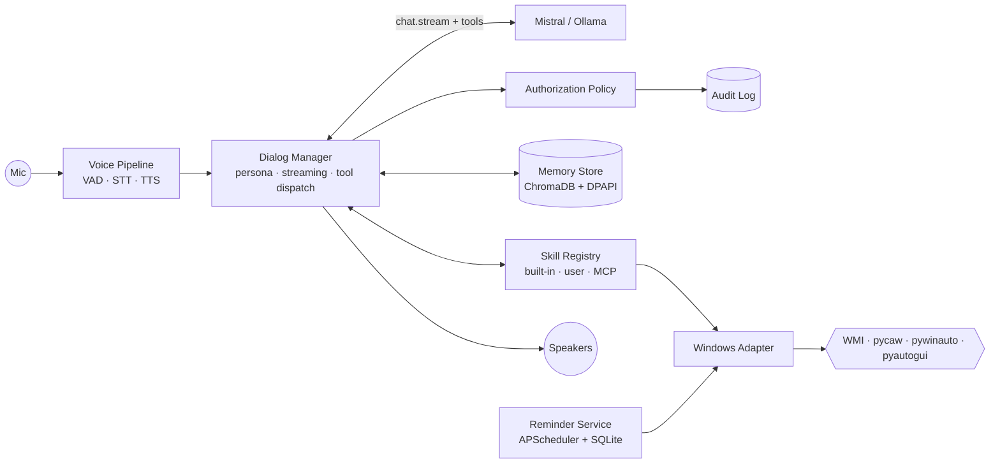

<div align="center">


# JARVIS

**Your private, voice-driven AI assistant for Windows.**

Cloud Mistral · local Whisper · neural Piper TTS · all running on your machine.

[](LICENSE)
[]()
[]()
[]()
[]()

</div>

---

## ✨ What is this

JARVIS is a desktop AI assistant that listens, thinks, acts, and talks back —
without sending your voice to any cloud. The wake-to-response budget is
under 800 ms. The model that reasons is Mistral; the model that hears you
is Whisper running on your CPU; the voice that answers is Piper.

It opens apps for you, runs timers, reads files, controls volume and
brightness — anything you'd reach for the keyboard for, you can ask out
loud instead.

## 🎬 Demo

> Drop a demo GIF here once recorded.

```
You:    Open Chrome and set a 10 minute timer for the pasta.
JARVIS: Right away, sir. Chrome is launching, and the timer is set.
```

## 🚀 Quick Start

### Option A — Installer (recommended)

1. Download the latest `JARVIS-Setup-1.0.0.exe` from
   [Releases](https://github.com/rofiperlungoding/jarvis/releases)
2. Run the installer — modern wizard walks you through every step
3. Launch JARVIS from your Start menu
4. The first-run wizard inside the app gets you connected (Mistral key, mic, voice)

### Option B — From source

```powershell
git clone https://github.com/rofiperlungoding/jarvis.git
cd jarvis
python -m venv .venv
.\.venv\Scripts\Activate.ps1
pip install -e .
python jarvis_app.py
```

You'll need a free Mistral API key from
[console.mistral.ai](https://console.mistral.ai). The app handles registering
it securely via Windows DPAPI.

## ✨ Features

- 🎙 **Three input modes** — push-to-talk, always-listening (VAD), text chat
- 🧠 **Cloud Mistral** for reasoning + function calling, with local Ollama fallback
- 🔒 **Local Whisper STT** — your voice never leaves your machine
- 🗣 **Neural Piper TTS** — five British/American voices, swap any time
- ⚡ **Built-in skills** — launch apps, control volume/brightness/media, set
  timers and reminders, read and summarize files
- 💾 **Encrypted memory** — ChromaDB vector store sealed with Windows DPAPI
- 🛡️ **Confirmation flow** — destructive actions speak a summary and wait for
  your "yes" before they fire
- 🔌 **Plugin system** — drop a `Skill` Protocol into any directory, JARVIS
  loads it at startup
- 📋 **MCP integration** — register external Model Context Protocol servers
  via config

## 🏗 Architecture



Single asyncio event loop with three cooperating loops — audio capture,
dialog, output — coordinated by bounded queues. CPU-bound model inference
(Whisper, Piper) runs in a thread pool.

## 📐 Configuration

JARVIS reads `%APPDATA%\Jarvis\config.toml` (deep-merged on top of shipped
defaults). The shipped defaults are reasonable; create the override file
only when you want to change something.

Key knobs:

```toml
[voice.tts]        voice = "en_GB-alan-medium"
[voice.stt]        local_only = true                  # never call cloud STT
[memory]           top_k = 5                          # 1..50
[reminders]        on_start_grace_seconds = 30        # >= 30
[automation.allowed_directories]
                   paths = ["%USERPROFILE%/Documents"]
[security]         network_destination_allowlist = [
                     "api.mistral.ai", "api.openweathermap.org", ...
                   ]
```

See [`docs/setup.md`](docs/setup.md) for the full walkthrough including
incognito mode and the wipe-all command.

## 📚 Documentation

- [`docs/setup.md`](docs/setup.md) — installer walkthrough + dev install + configuration
- [`docs/plugins.md`](docs/plugins.md) — authoring custom Skills and MCP servers
- [`docs/architecture.md`](docs/architecture.md) — threading model, event flow, persistence layout
- [`docs/troubleshooting.md`](docs/troubleshooting.md) — diagnostic recipes when things go wrong

## 🔌 Plugin development

Drop a `*.py` file with a top-level `SKILL: Skill` into your `plugin_dirs`
and JARVIS loads it at startup. Schemas are validated against the
Mistral function-calling subset.

```python
from jarvis.skills.base import Skill, SkillContext, SkillManifest, SkillResult

class HelloSkill:
    manifest = SkillManifest(
        name="HelloSkill",
        description="Say hello to a friend.",
        json_schema={
            "type": "object",
            "properties": {"name": {"type": "string"}},
            "required": ["name"],
            "additionalProperties": False,
        },
    )

    async def execute(self, args, ctx):
        return SkillResult.success({"greeting": f"Hello, {args['name']}!"})

SKILL: Skill = HelloSkill()
```

See [`docs/plugins.md`](docs/plugins.md) for the full plugin authoring guide
including MCP servers and the worked WeatherEcho example.

## 🧪 Testing

```powershell
pytest                 # 1666 passing, 7 intentional skips
ruff check src/ tests/
mypy src/ tests/
```

Includes 16 property-based tests with Hypothesis covering serialization
round-trips, schema validation, memory determinism, authorization audit
ordering, persona invariance, and more.

## 🤝 Contributing

Pull requests welcome. Please run `pytest`, `ruff check`, and `mypy` before
submitting. Bigger changes — open an issue first to discuss the approach.

## 📜 License

MIT. See [LICENSE](LICENSE).

Copyright © 2026 JARVIS Contributors.
